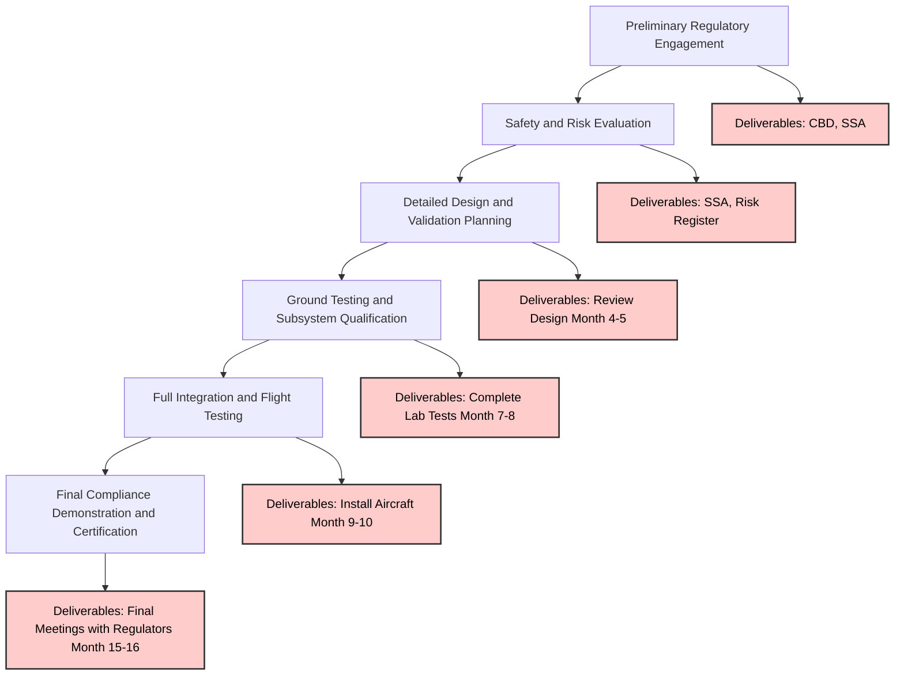

# GPAM-AMPEL-0201-71-001-A – Q-01 Quantum Propulsion System (QPS) – Certification Compliance Roadmap

**Versione:** 1.3  
**Fecha:** 2025-02-25  
**Estado:** Borrador  
**Autores:** Amedeo Pelliccia & AI Collaboration

---

## 1. Introducción

### 1.1 Propósito del Roadmap
- **Objetivo Principal:**  
  Stabilire un quadro passo a passo per ottenere la conformità regolatoria del Q-01 Quantum Propulsion System (QPS).

- **Obiettivi Specifici:**  
  - Assicurare la conformità con norme di aeronavigabilità e sicurezza (FAR 33, CS-E, MIL-STD-882).
  - Definire un piano di validazione e prove per la tecnologia di propulsione quantistica.
  - Delineare il percorso di approvazione presso FAA/EASA, considerando condizioni speciali per sistemi innovativi.

### 1.2 Alcance
- **Certificación de Componentes:**  
  - Certificazione della planta motrice (FAR 33 / EASA CS-E)
  - Valutazioni di sicurezza e rischi (MIL-STD-882)
  - Conformità ambientale ed EMI/EMC (DO-160 / MIL-STD-461)

- **Integración y Test:**  
  - Prove di volo integrate nell’aeronave AMPEL360XWLRGA
  - Gestione dei dati e documentazione (utilizzo di S1000D e l’indice “Cosmic”)

- **Nota:**  
  Aspetti di certificazione a livello di aeronave sono considerati solo se il Q-01 impatta direttamente sulla sicurezza o sulle prestazioni globali.

---

## 2. Requisitos Regolatori y Brevi Identificati

### 2.1 Via di Conformità FAA / EASA
- **FAR 33 / CS-E (Certificazione dei Motori):**  
  - Prove di spinta, stress e fatica, inclusi parametri specifici per la coerenza quantistica e il contenimento dell'energia.  
    *Specific tests and pass/fail criteria will be defined based on GPPM-QPROP-0401-04-006-A – Q-01 Performance Metrics & Testing.*

- **FAR 23/25 / CS-23/CS-25 (Aeronavigabilità):**  
  - Integrazione in volo e conformità ambientale (test in condizioni estreme).

### 2.2 Requisitos MIL-STD
- **MIL-STD-882:**  
  Analisi dei rischi e mitigazione per eventuali guasti quantistici.
- **MIL-STD-1553:**  
  Compatibilità del FADEC quantistico con sistemi avionici standard.
- **MIL-STD-461:**  
  Prove per EMI/EMC per assicurare immunità e conformità delle emissioni.

### 2.3 Condizioni Speciali y Brevi
- **Tecnologia Innovativa:**  
  - Rischio di decoerenza, sfide nella certificazione del FADEC basato su AI, e gestione di alte densità energetiche.
- **Strategia Regolatoria:**  
  - Proposte di condizioni speciali a FAA/EASA e collaborazione con enti di ricerca per affinare metodologie di prova.

---

## 3. Strategia di Certificazione – Fasi Principali

### 3.1 Coinvolgimento Regolatorio Preliminare
- **Azioni:**  
  - Incontri iniziali con FAA/EASA.
  - Analisi delle lacune normative e stesura di un Piano di Certificazione (CP).

- **Deliverables:**  
  - Documento di Base di Certificazione (CBD).
  - Analisi Preliminare della Sicurezza del Sistema (SSA).

### 3.2 Valutazione di Sicurezza e Rischi
- **Azioni:**  
  - Analisi dei rischi funzionali (FHA, FTA, AMEF).
  - Creazione di un Registro dei Rischi con valutazione di probabilità e impatto.

- **Deliverables:**  
  - Sistema di Safety Assessment (SSA).
  - Registro dei Rischi Dettagliato.

### 3.3 Pianificazione di Design e Validazione Dettagliata
- **Azioni:**  
  - Revisione e congelamento del design.
  - Stesura di un Piano di Prove di Qualificazione (QTP) e tracciabilità dei dati.

- **Milestones:**  
  - Revisione preliminare (Mese 4) e congelamento finale del design (Mese 5).

### 3.4 Test a Terra e Qualificazione dei Sottosistemi
- **Azioni:**  
  - Prove individuali e di integrazione, incluse prove ambientali (DO-160 / MIL-STD-810).

- **Milestones:**  
  - Completamento dei test in laboratorio (Mese 7) e integrazione completa (Mese 8).

### 3.5 Integrazione Completa e Prove di Volo
- **Azioni:**  
  - Integrazione nel velivolo e prove di volo in fasi:
    - **Phase 1 (Low Thrust):**  
      - Thrust levels up to 25% of maximum rated thrust (NTR).  
      - *Objective:* Verificare la funzionalità di base del motore, stabilità, letture dei sensori e performance iniziale del FADEC.  
      - *Instrumentation:* Sensori base per spinta, temperatura e pressione.
    - **Phase 2 (High Thrust):**  
      - Thrust levels between 25% and 100% NTR.  
      - *Objective:* Valutare la performance su tutto l'envelope operativo, inclusa la vettorizzazione della spinta.  
      - *Instrumentation:* Sensori ad alta precisione per spinta, vibrazioni e misurazione dello stato quantistico.
    - **Phase 3 (Endurance):**  
      - Voli prolungati a vari livelli di spinta.  
      - *Objective:* Valutare l'affidabilità a lungo termine e la stabilità.
    - **Azioni Complementari:**  
      - Controllo dei protocolli di emergenza e procedure di fallback.
  
- **Milestones:**  
  - Installazione sull'aeromobile (Mese 9).  
  - Campagna di prove iniziali (Mesi 10–12).  
  - Estensione delle prove (Mesi 12–14).

### 3.6 Dimostrazione Finale di Conformità e Certificazione
- **Azioni:**  
  - Audit, presentazione dei dati, e compilazione della matrice di conformità.  
  - Ottenimento del Type Certificate (TC) dopo approvazione.

- **Milestones:**  
  - Incontri finali con i regolatori (Mesi 15–16).  
  - Decisione sulla certificazione (Mese 18).

---

## 4. Strategia di Test e Validazione

- **Tipi di Prove:**
  - **Stabilità Quantica:**  
    Misurare tempo di coerenza, fedeltà e precisione.
  - **Ambientali:**  
    Verificare l'operatività in condizioni estreme (temperatura, vibrazione, EMI/EMC).
  - **Performance di Spinta:**  
    Valutare il massimo empuje, il tempo di risposta e la precisione del vettore di spinta.
  - **Resistenza:**  
    Monitoraggio continuo per garantire la stabilità a lungo termine.

- **Metriche Chiave:**
  - Tempo di coerenza: >1 s.
  - Fedeltà: >99.9%.
  - Spinta: [Valori variabili, definiti nel QTP].
  - Efficienza e consumo energetico: [Valori variabili, definiti nel QTP].
  - Tasso di decoerenza: < X eventi/ora (da definire nel QTP).
  - EM Emissions: Conforme a MIL-STD-461.

---

## 5. Gestión de Datos y Trazabilidad

- **Data Modules S1000D:**  
  Utilizzati per la documentazione di manutenzione (AMM), catalogo parti (IPC) e troubleshooting.

- **Índice “Cosmic”:**  
  Archivio centralizzato per i risultati dei test, analisi dei rischi e disegni.  
  *Descrizione:* Il "Cosmic" index è un sistema centralizzato basato sul web che consente il version control, l'accesso sicuro e la tracciabilità delle informazioni, con validazione automatica dei dati e integrazione con i Data Modules S1000D.

- **Referencias Cruzadas:**  
  Allineamento dei codici documentali (es. GPAM-AMPEL-0201-53-50-FEA-001) per garantire una completa tracciabilità.

---

## 6. Fattori Umani e Interfaccia Pilota

- **Interfaccia in Cabina:**  
  - Schermi che mostrano in tempo reale lo stato quantico, il livello di empuje e eventuali alert di guasto.  
  - Design HMI intuitivo per consentire aggiustamenti rapidi.

- **Formazione dei Piloti:**  
  - Training specifico sulla fisica quantistica e sulle procedure di emergenza.

- **Carico di Lavoro:**  
  - Valutazione dell'impatto dell’AI sul carico di lavoro del pilota e analisi dello stress operativo, supportata da simulazioni dedicate.

---

## 7. Colaboración y Alleanze

- **Istituzioni di Ricerca:**  
  - NASA, ESA, DARPA, Caltech, Università di Cambridge.

- **Partner Industriali:**  
  - CryoCore LLC, QuantumDrive Inc., MechaAI Solutions.

- **Obiettivo:**  
  Favorire la collaborazione per l’innovazione, la validazione delle metodologie di prova e lo sviluppo tecnologico avanzato.

---

## 8. Gestione dei Rischi

- **Principali Rischi:**
  - **Decoerenza Quantica:**  
    Implementazione di blindaggio, sistemi di refrigerazione criogenica e tecniche di correzione degli errori.
  - **FADEC con AI:**  
    Validazione rigorosa degli algoritmi, ridondanze e procedure di fallback.
  - **Contención de Energía Exótica:**  
    Analisi delle alte densità energetiche e implementazione di misure di sicurezza multiple.

- **Registro dei Rischi:**  
  Monitoraggio continuo tramite l’indice “Cosmic” con valutazioni di probabilità e impatto aggiornate.

---

## 9. Diagramma e Descrizione del Sistema

**[Detailed Block Diagram]**

*Il diagramma testuale seguente illustra il flusso di energia, dati e controllo tra i componenti principali del QPS-01:*



**Legenda:**  
- **(Línea Roja - Energía):** Flusso elettrico di energia.  
- **(Línea Azul - Datos):** Flusso di dati e segnali di controllo.  
- **(Línea Verde - Refrigerante):** Flusso di refrigerante.  
- **(Línea Negra - Vacío):** Livello di pressione del vuoto.  
- **[ ]:** Indica un segnale o flusso di dati.  
- **+ :** Indica componenti o aggregazioni di elementi.  
- **->:** Indica la direzione del flusso.

*KPIs e Punti di Sensori:*
- **QSM:**  
  - Fidelità dell’entanglement, tempo di coerenza, temperatura della camera.
- **QEE:**  
  - Output di spinta, tasso di estrazione energetica, angolo di vettorizzazione (TVM).
- **FADEC:**  
  - Output degli algoritmi AI, log delle decisioni (XAI).
- **TMS:**  
  - Temperatura e pressione del refrigerante.
- **Power Supply:**  
  - Input di potenza, tensione e corrente.

---

## 10. Strategia de Distribución y Actualización

- **Formati di Pubblicazione:**  
  La documentazione verrà resa disponibile in PDF, HTML5 ed ePub con navigazione interattiva.

- **Gestione degli Accessi:**  
  Un portale web sicuro sarà utilizzato per garantire l'accesso controllato agli stakeholder.

- **Integrazione API:**  
  Sarà predisposto un accesso programmabile per sincronizzazione e aggiornamento continuo dei dati.

---

## 11. Conclusión

Il documento definisce una struttura documentale completa che integra S1000D con gli standard ATA e altre normative rilevanti.  
**Vantaggi Chiave:**
- **Modularità e Scalabilità:**  
  Gestione flessibile grazie ai Data Modules.
- **Tracciabilità e Uniformità:**  
  Sistema di numerazione gerarchica per una facile reperibilità.
- **Conformità Normativa:**  
  Allineamento con standard internazionali per garantire sicurezza e qualità.
- **Efficienza Operativa:**  
  Automazione tramite CI/CD, CSDB e API per aggiornamenti e manutenzione continua.

Questa struttura permette al sistema AMPEL-360XWLRGA di essere mantenuto in modo efficiente e scalabile, rispondendo alle esigenze evolutive del settore aerospaziale.

---

## 12. Strumenti e Validazione

- **Editor XML & Validator:**  
  Utilizzo di strumenti (es. Oxygen XML Editor) per validare i Data Modules.

- **CSDB Integration:**  
  I moduli sono integrati in un Common Source DataBase per facilitare aggiornamenti e versioning.

- **Pipeline CI/CD:**  
  Automazione per la validazione continua secondo S1000D e il tracciamento delle modifiche.

---

## 13. Distribución y Actualizaciones

- **Formati di Pubblicazione:**  
  PDF, HTML5, ePub con funzionalità interattive.

- **Gestione degli Accessi:**  
  Portale web sicuro per gli stakeholder.

- **Integrazione API:**  
  Accesso programmabile per la sincronizzazione e l’aggiornamento dei dati.

---

## 14. Note Finali

- **Struttura Adattabile:**  
  Progettata per estendersi a ogni capitolo ATA.
- **Tracciabilità P/N e DMC:**  
  Ogni sezione è associata a codici specifici per garantire conformità e aggiornamenti continui.
- **Aggiornamenti Continui:**  
  Il sistema è predisposto per integrare nuovi standard (es. S1000D Issue 6.1, aggiornamenti DO-178C) e mantenere la documentazione sempre aggiornata.

---

*Fonte: GitHub release page*
```
