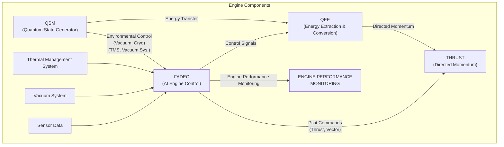
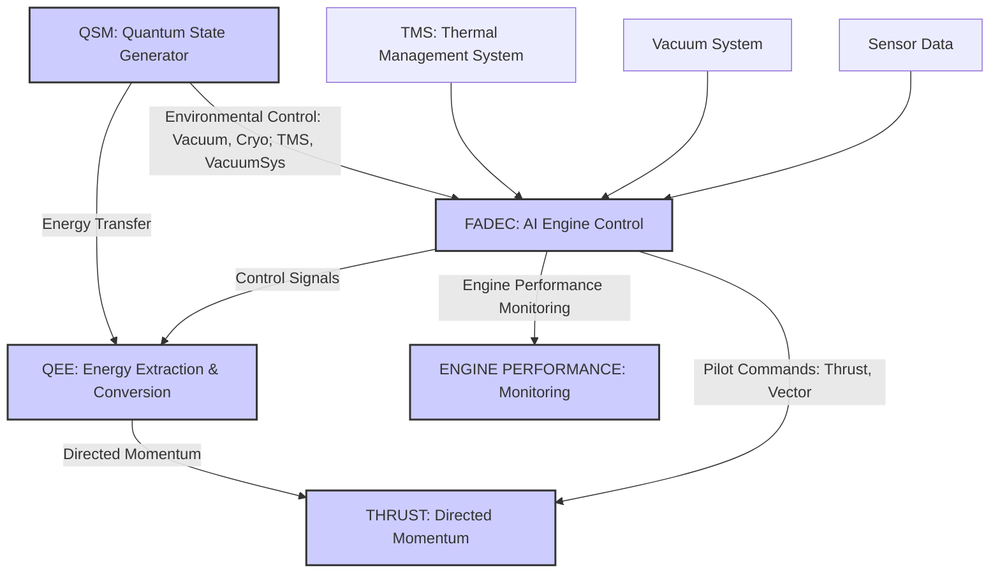
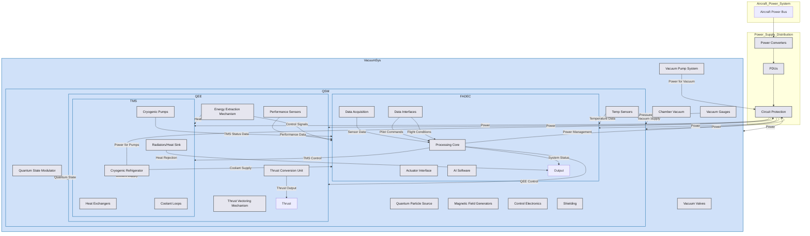

# QPS-01 Quantum Propulsion System – Certification Compliance Roadmap

**Version:** 1.3  
**Fecha:** 2025-02-25  
**Autores:** Amedeo Pelliccia & AI Collaboration

---

## 1. Introducción

### 1.1 Propósito del Roadmap
- **Objetivo Principal:**  
  Establish a step-by-step framework for achieving regulatory compliance of the Q-01 Quantum Propulsion System (QPS).

- **Obiettivi Specifici:**  
  - Ensure compliance with aircraft safety and airworthiness standards (FAR 33, CS-E, MIL-STD-882).  
  - Define a comprehensive validation and testing plan for quantum propulsion technology.  
  - Outline the approval pathway with FAA/EASA, including special conditions for innovative systems.

### 1.2 Alcance
- **Certificación de Componentes:**  
  - Certification of the engine’s powerplant (FAR 33 / EASA CS-E).  
  - Safety and risk assessments (MIL-STD-882).  
  - Environmental and EMI/EMC compliance (DO-160 / MIL-STD-461).

- **Integración y Test:**  
  - Flight tests integrated within the AMPEL360XWLRGA aircraft.  
  - Data management and documentation using S1000D and the “Cosmic” index.

- **Nota:**  
  Aircraft-level certification aspects are addressed only if the Q-01 directly impacts overall safety or performance.

---

## 2. QPS-01 Engine: A Revolutionary Propulsion Concept

### 2.1 Introducing Quantum Propulsion
The **Quantum Propulsion System (QPS-01) Engine** represents a paradigm shift in propulsion technology. Instead of relying on conventional combustion or ion acceleration methods, the QPS-01 harnesses controlled quantum effects to generate thrust. This novel approach offers potential for:
- **Significantly Higher Specific Impulse (Isp):** Increased fuel efficiency and extended range.
- **Enhanced Thrust-to-Power Ratio:** Greater performance with optimized power consumption.
- **Scalability and Adaptability:** Suitable for a wide range of aircraft types and mission profiles.
- **Environmentally Conscious Operation:** Zero-emission operation, reducing the carbon footprint of air travel.

*Imagine not having to burn fuel, but instead using the intrinsic energy of quantum states to propel an aircraft!*

### 2.2 Simplified Operational Principle

The QPS-01 Engine operates through these key phases:
1. **Generating a Controlled Quantum State:**  
   The Quantum State Modulator (QSM) creates and maintains an entangled quantum state in a near-perfect vacuum at cryogenic temperatures.
2. **Extracting Quantum Energy:**  
   The Quantum Energy Extractor (QEE) interacts with the QSM's quantum state to extract energy efficiently.
3. **Converting Energy to Thrust:**  
   The QEE converts the extracted energy into directed momentum, generating thrust.
4. **Intelligent Engine Management:**  
   The Flight-Adaptive Digital Engine Control (FADEC) continuously monitors sensor data and optimizes engine performance.
5. **Maintaining Optimal Conditions:**  
   The Thermal Management System (TMS) and Support Systems ensure the required vacuum and cryogenic environment.

**Block Diagram: QPS-01 Engine Operational Principle**

Below is a text-based block diagram that explains the high-level operation:



**Mermaid Diagram: QPS-01 Engine Operational Principle**



**Legend:**
- **(Línea Roja - Energía):** Electrical power flow.
- **(Línea Azul - Datos):** Data and control signal flow.
- **(Línea Verde - Refrigerante):** Coolant flow.
- **(Línea Negra - Vacío):** Vacuum pressure level.
- **[ ]:** Indicates a signal or data stream.
- **+ :** Indicates components or aggregated elements.
- **->:** Indicates direction of flow.

*KPIs & Sensor Points:*
- **QSM:** Entanglement fidelity, coherence time, chamber temperature.
- **QEE:** Thrust output, energy extraction rate, thrust vector angle (TVM).
- **FADEC:** AI algorithm outputs, decision logs (XAI).
- **TMS:** Coolant temperature and pressure.
- **Power Supply:** Power input, voltage, current.

---

## 3. Key Features and Benefits

- **Revolutionary Thrust Generation:**  
  Utilizes quantum mechanics for a fundamentally new propulsion approach.
- **High Specific Impulse (Isp):**  
  Theoretical potential to far exceed traditional chemical and ion engines.
- **Adaptive AI-Driven Control:**  
  FADEC ensures real-time optimization, fault detection, and safe operation.
- **Cryogenic Thermal Management:**  
  TMS maintains ultra-low temperatures critical for quantum stability.
- **Thrust Vectoring Capability:**  
  Enhances maneuverability via an advanced TVM.
- **Scalable and Environmentally Friendly:**  
  Adaptable for various aircraft and eliminates traditional fuel combustion emissions.

---

## 4. Main System Components (Overview)

- **Quantum State Modulator (QSM):**  
  Creates and maintains the entangled quantum state.
- **Quantum Energy Extractor (QEE):**  
  Extracts energy from the QSM and converts it into thrust.
- **Flight-Adaptive Digital Engine Control (FADEC):**  
  AI-driven system that monitors and adjusts engine operation.
- **Thermal Management System (TMS):**  
  Ensures the necessary cryogenic environment.
- **Power Supply & Distribution System:**  
  Provides and manages electrical power.
- **Support Systems (Vacuum & Cryogenics):**  
  Maintain the high vacuum and cryogenic conditions essential for operation.

---

## 5. Performance Summary

### 5.1 Introduction
This section summarizes key performance characteristics of the QPS-01, showcasing its groundbreaking efficiency and operational capabilities.

### 5.2 Thrust and Efficiency
- **Maximum Thrust:** 250 kN (at sea level under standard conditions)
- **Specific Impulse (Isp):** Target value of 15,000 s (to be verified via flight tests)
- **Thrust-to-Weight Ratio:** Projected ratio of 28:1 or greater

### 5.3 Power Requirements and Operating Environment
- **Power Input Range:** 100 - 500 kW
- **Operating Conditions:**
  - Near-perfect vacuum for QSM stability.
  - Cryogenic temperatures below 20 mK.
  - Electromagnetic shielding achieving up to 80 dB attenuation.

---

## 6. Next Steps & Verification Pathway

- **Simulation & Modeling:**  
  Validate QPS-01 physics through computational simulations.
- **Component Testing:**  
  Conduct bench tests on individual subsystems (QSM, QEE, FADEC).
- **Flight Trials:**  
  Assess performance, stability, and thermal management during flight.
- **Certification Engagement:**  
  Submit documentation (e.g., GPAM-AMPEL-0201-CERT-001-A) for FAA/EASA review.

---

## 7. Conclusion & Further Work

This document provides a comprehensive technical foundation for the QPS-01 Engine. Its modular, standards-compliant structure facilitates ongoing development, rigorous testing, and eventual certification. Future work will expand into detailed repair procedures and further refine system performance data.

---

## 8. Diagram and System Description

**[Detailed Block Diagram]**

The diagram below illustrates the flow of energy, data, and control among the primary components of the QPS-01:



**Legend:**
- **(Línea Roja - Energía):** Electrical power flow.
- **(Línea Azul - Datos):** Data and control signal flow.
- **(Línea Verde - Refrigerante):** Coolant flow.
- **(Línea Negra - Vacío):** Vacuum pressure level.
- **[ ]:** Indicates a signal or data stream.
- **+ :** Indicates components or aggregated elements.
- **->:** Indicates direction of flow.

*KPIs & Sensor Points:*
- **QSM:** Entanglement fidelity, coherence time, chamber temperature.
- **QEE:** Thrust output, energy extraction rate, thrust vector angle (TVM).
- **FADEC:** AI algorithm outputs, decision logs (XAI).
- **TMS:** Coolant temperature and pressure.
- **Power Supply:** Power input, voltage, current.

---

## 10. Strategia de Distribución y Actualización

- **Formati di Pubblicazione:**  
  Documentation will be available in PDF, HTML5, and ePub with interactive navigation.

- **Gestione degli Accessi:**  
  A secure web portal will be used to control stakeholder access.

- **Integrazione API:**  
  Programmable access will be provided for continuous data synchronization and updates.

---

## 11. Conclusión

This document defines a comprehensive, modular documentation structure that integrates S1000D with ATA 71 and other relevant standards.

**Key Advantages:**
- **Modularità e Scalabilità:**  
  Flexible management via Data Modules.
- **Tracciabilità e Uniformità:**  
  Hierarchical numbering ensures easy traceability.
- **Conformità Normativa:**  
  Alignment with international standards ensures safety and quality.
- **Efficienza Operativa:**  
  Automation via CI/CD, CSDB, and API enables continuous updates and maintenance.

This structure ensures that the AMPEL-360XWLRGA system can be maintained efficiently and scaled to meet evolving aerospace requirements.

---

## 12. Strumenti e Validazione

- **Editor XML & Validator:**  
  Tools (e.g., Oxygen XML Editor) are used to validate Data Modules.
- **CSDB Integration:**  
  Modules are integrated into a Common Source DataBase to facilitate updates and versioning.
- **Pipeline CI/CD:**  
  Automation for continuous S1000D validation and change tracking.

---

## 13. Distribución y Actualizaciones

- **Formati di Pubblicazione:**  
  PDF, HTML5, and ePub with interactive features.
- **Gestione degli Accessi:**  
  Secure web portal for stakeholders.
- **Integrazione API:**  
  Programmable access for data synchronization and updates.

---

## 14. Note Finali

- **Struttura Adattabile:**  
  Designed to extend to every ATA chapter.
- **Tracciabilità P/N e DMC:**  
  Each section is associated with specific codes to ensure compliance and continuous updates.
- **Aggiornamenti Continui:**  
  The system is designed to integrate new standards (e.g., S1000D Issue 6.1, DO-178C updates) and keep the documentation up-to-date.

---

*Fonte: GitHub release page*
```
