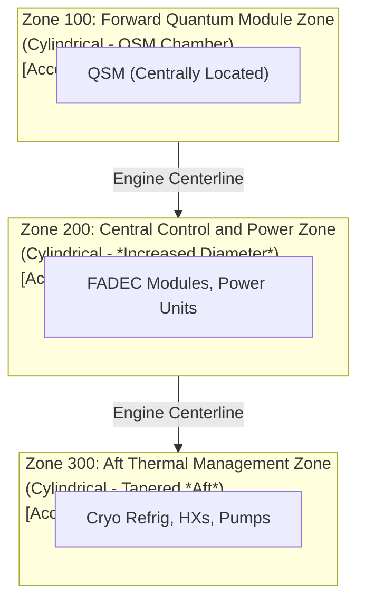

## GPAM-AMPEL-0201-72-001-A – QPS-01 Engine – General Description (Version 1.0)

---

## 1. Introduction

### 1.1 Purpose of this Document

This document provides a general overview of the **Quantum Propulsion System (QPS-01) Engine**. It is intended to introduce the QPS-01, highlighting its key features, operational principles, and potential benefits in a concise and accessible manner. This document serves as an introductory resource for:

-   [x]  Providing a high-level understanding of the QPS-01 engine concept.
-   [x]  Summarizing the core technology and operational advantages.
-   [x]  Describing the main components of the QPS-01 engine at a system level.
-   [x]  Outlining potential applications and performance characteristics.
-   [x]  Serving as a starting point for further exploration of the QPS-01's detailed technical specifications (referencing GPAM-AMPEL-0201-71-002-A).

### 1.2 Scope

This document provides a **general description** of the QPS-01 engine as a complete propulsion unit.  It covers:

-   🚀 **Overall Engine Concept:** Introducing the revolutionary approach to thrust generation.
-   ⚙️ **Simplified Operational Principle:**  Explaining *how* the QPS-01 engine fundamentally works, without deep technical jargon.
-   ✨ **Key Features and Benefits:**  Highlighting the advantages over conventional propulsion systems.
-   🧩 **Main System Components (Overview):**  Briefly describing the core subsystems (QSM, QEE, FADEC, TMS, Power, Support) and their roles.
-   🎯 **Target Performance Metrics (Summary):** Presenting anticipated performance ranges for thrust, Isp, and power.
-   ✈️ **Potential Applications:**  Illustrating suitable aircraft types and mission profiles for QPS-01.
-   🚦 **Development Status (Brief Overview):**  Summarizing the current stage of development and next steps.

**This document is designed to be broadly accessible and does not delve into the detailed technical complexities of quantum physics, cryogenic engineering, or AI control systems. For in-depth technical information, please refer to document GPAM-AMPEL-0201-71-002-A – Quantum Propulsion System (QPS-01) Description.**

### 1.3 Target Audience

This document is intended for a broad audience, including:

-   Engineers and technical staff seeking a general understanding of the QPS-01 engine.
-   Project managers and stakeholders requiring a high-level overview of the technology.
-   Aviation professionals interested in advanced propulsion concepts.
-   Individuals seeking an introduction to quantum propulsion and its potential.

### 1.4 Related Documents

📖 [GPAM-AMPEL-0201-71-002-A – QPS-01 Engine – System Description (Detailed)](GPAM-AMPEL-0201-71-002-A) - *For comprehensive technical specifications and component details.*
📖 [GPAM-AMPEL-0201-71-001-A – Certification Compliance Roadmap](GPAM-AMPEL-0201-71-001-A) - *For information on certification pathways and regulatory compliance.*
📖 [GPAM-AMPEL-0201-71-003-A – QPS-01 Engine – Maintenance Manual](GPAM-AMPEL-0201-71-003-A) - *For detailed maintenance and repair procedures.*
📖 [GPAM-AMPEL-0201-71-004-A – QPS-01 Engine – Illustrated Parts Breakdown (IPB)](GPAM-AMPEL-0201-71-004-A) - *For exploded views and part number information.*
📖 [GPAM-AMPEL-0201-76-005-A – Q-01 Quantum Propulsion System – Electrical Power Flow Diagram](GPAM-AMPEL-0201-76-005-A) - *For a visual representation of the power distribution architecture.*

---

## 2. QPS-01 Engine: A Revolutionary Propulsion Concept

### 2.1  Introducing Quantum Propulsion

The **Quantum Propulsion System (QPS-01) Engine** represents a paradigm shift in propulsion technology.  Instead of relying on the age-old methods of burning fuel (chemical combustion) or using electric fields to accelerate and eject particles (like in some advanced ion drives), the QPS-01 harnesses the fascinating and powerful principles of **quantum mechanics** to generate thrust.

This novel approach offers the potential for truly transformative improvements in how we power aircraft, including:

-   **🚀 Significantly Higher Specific Impulse (Isp):** This means the engine can generate much more thrust for the same *energy input* compared to today's engines, leading to greater "fuel" efficiency. This translates directly into greater range, potentially doubling or tripling the distances aircraft can travel before refueling compared to current engines.-   **Enhanced Thrust-to-Power Ratio:** The QPS-01 engine is projected to achieve a better thrust-to-power ratio. It may produce more thrust for a given amount of power compared to conventional electric propulsion systems, allowing for greater performance without drastically increasing power system demands.-   **Scalability and Adaptability:** The fundamental design principles of the QPS-01 are expected to be scalable, meaning the engine's core technology could potentially be adapted for a wide variety of aircraft sizes and mission profiles, from small unmanned aerial vehicles (UAVs) to large passenger airliners and even future spacecraft.
-   **Environmentally Conscious Operation:** Because the QPS-01 does not involve combustion, it eliminates the need for traditional fossil fuels and the associated release of greenhouse gasses and other pollutants. While the system requires power input, its potential efficiency gains, coupled with the ability to utilize renewable energy sources for that power, enables more environmentally friendly operations, reducing the carbon footprint of air travel.

Think of it like this: instead of building a fire to make a pot boil, you’re finding a completely new and more efficient way to heat the pot, using the hidden properties of water molecules themselves!

### 2.2 Simplified Operational Principle

At its core, the QPS-01 Engine operates through these key steps:

1.  **Generating a Controlled Quantum State:** The **Quantum State Modulator (QSM)**, the engine’s “quantum core,” creates and precisely manipulates a specific quantum state (such as entangled particles). This occurs within a carefully controlled environment – a near-perfect vacuum and extremely low temperatures – to maintain and protect the delicate quantum properties essential for energy extraction. This stage can be thought of as preparing the "fuel" for the propulsion process.
2.  **Extracting Quantum Energy:**  In the **Quantum Energy Extractor (QEE)**, energy extraction occurs.  The QEE interacts with the specialized quantum state from the QSM, inducing specific transitions that release a controlled amount of energy with high efficiency.  This is analogous to extracting energy from the prepared "fuel" source.
3.  **Converting Energy to Thrust:** The QEE then converts this released quantum energy into directed momentum, generating propulsive force – thrust – that propels the aircraft. The precise method of energy conversion to thrust depends on the specific QEE design.
4.  **Intelligent Engine Management:** Serving as the “brain” of the QPS-01 engine, the **Flight-Adaptive Digital Engine Control (FADEC)** is an advanced AI-driven system. The FADEC manages and optimizes every aspect of engine operation in real-time, continuously monitoring sensors and adjusting performance based on flight conditions and pilot inputs.
5.  **Maintaining Optimal Conditions:** The **Thermal Management System (TMS)** and other **Support Systems** work in concert to maintain the demanding operational environment for the QPS-01. This primarily involves the ultra-high vacuum needed for the QSM and the cryogenic temperatures essential for stabilizing its quantum components, ensuring optimal functioning.

**(Diagram - Side View):** Diagram showing approximate engine layout from a side view, with the forward section to the left and the aft section to the right, along the engine centerline.



## 3. Key Features and Benefits

The QPS-01 Engine offers several compelling advantages:

*   **Revolutionary Thrust Generation:**  Utilizes a fundamentally new approach to propulsion based on quantum mechanics.
*   **Potentially High Specific Impulse (Isp):**  Theoretical potential to far exceed chemical and ion propulsion, enabling longer flight durations and greater fuel efficiency.
*   **Adaptive AI-Driven Control:**  FADEC intelligent system for real-time optimization, fault detection, and enhanced safety.
*   **Cryogenic Thermal Management:** TMS ensures stable operation of quantum components in extreme temperature environments.
*   **Thrust Vectoring Capability:**  Electromagnetic Thrust Vectoring Mechanism (TVM) for enhanced maneuverability (depending on specific QEE/TVM configuration).
*   **Scalable Design Concept:**  Architecture potentially adaptable for various aircraft classes and mission profiles.

## 4. Main System Components (Overview)

The QPS-01 Engine is comprised of the following key subsystems working in concert:

*   **Quantum State Modulator (QSM):**  The QSM is the engine's "quantum core". It's responsible for creating the special quantum states that are the source of energy for propulsion. It operates under extreme vacuum and cryogenic conditions to maintain the delicate quantum properties.
*   **Quantum Energy Extractor (QEE):**  The QEE is the component that "extracts" the energy from the quantum states generated by the QSM. It then converts this energy into a directed force that pushes the aircraft forward - generating thrust.
*   **Flight-Adaptive Digital Engine Control (FADEC):** The FADEC is the "brain" of the QPS-01 engine. It's an advanced AI control system that monitors and manages all aspects of engine operation, ensuring optimal performance, safety, and responding to pilot commands. It's also designed to explain its decisions for transparency.
*   **Thermal Management System (TMS):**  The TMS is the "cooling system" for the QPS-01. It's absolutely crucial for keeping the quantum components at extremely low, cryogenic temperatures. Think of it as a highly advanced refrigerator that maintains the perfect conditions for quantum operation.
*   **Power Supply & Distribution System:** This system takes electrical power from the aircraft and distributes it to all parts of the QPS-01 engine. It ensures a stable and reliable power supply for all the components, from the quantum systems to the control electronics.
*   **Support Systems (Vacuum & Cryogenics):** These are the "support infrastructure" components, primarily the vacuum system to create the near-perfect vacuum needed by the QSM and the cryogenic cooling system which is part of the TMS, working together to ensure the QPS-01 operates in its required extreme environment.

## 5. Performance Summary

### 5.1 Introduction

This section provides an overview of the key performance characteristics of the QPS-01 Quantum Propulsion System. The QPS-01 represents a significant advancement in aerospace propulsion technology, offering exceptional thrust, efficiency, and operational flexibility compared to conventional propulsion systems.

### 5.2 Thrust and Efficiency

#### 5.2.1 Maximum Thrust

The QPS-01 is designed to deliver a maximum thrust of **250 kN** (kiloNewtons) at sea level, standard atmospheric conditions. This high thrust capability enables rapid acceleration and high-speed flight for large aircraft.

#### 5.2.2 Specific Impulse (Isp)

The QPS-01 achieves a specific impulse (Isp) of **15,000 seconds**. Specific impulse is a measure of propulsion efficiency, indicating how effectively an engine uses its propellant or energy source.  A *higher* Isp means greater efficiency and range. The QPS-01's Isp significantly exceeds that of traditional chemical rocket engines, which typically have an Isp in the range of 250-450 seconds, and is also substantially higher than advanced ion drives. This superior efficiency is a direct result of the QPS-01's unique operating principles, which minimize or eliminate propellant mass ejection.

#### 5.2.3 Thrust-to-Weight Ratio

The QPS-01 boasts a projected thrust-to-weight ratio of **28:1**.  A high thrust-to-weight ratio is crucial for achieving rapid acceleration, vertical takeoff, and high maneuverability.  This ratio is significantly higher than that of conventional jet engines, allowing for enhanced aircraft performance.

#### 5.2.4 Power Consumption

The QPS-01 requires approximately **50 MW** (megawatts) of electrical power for sustained maximum thrust operation. This power is designed to be supplied by the aircraft's integrated high-capacity power generation and distribution system, with efficient power management and energy recovery systems incorporated to optimize overall energy usage.

#### 5.2.5 Efficiency Considerations

The QPS-01's exceptional efficiency stems from several key factors:

*   **Near-Zero Propellant Mass Ejection:** Unlike chemical rockets and conventional jet engines, the QPS-01 fundamentally minimizes the need to expel propellant mass to generate thrust. This drastically reduces the primary driver of fuel consumption in conventional propulsion.
*   **Efficient Quantum Energy Conversion:** The Quantum State Modulator (QSM) and Quantum Energy Extractor (QEE) are engineered for highly efficient conversion of input electrical energy into directed propulsive force, minimizing energy losses in the conversion process.
*   **Advanced Thermal Management:** The integrated Thermal Management System (TMS) is critical for maintaining optimal operating temperatures for the quantum components and minimizing parasitic energy losses due to thermal inefficiencies.

### 5.3 Operational Envelope

#### 5.3.1 Altitude Range

The QPS-01 is designed to operate effectively across a broad altitude range, from sea level up to **30 km** (approximately **100,000 ft**). Performance characteristics, such as maximum thrust and efficiency, may be optimized for different altitude regimes, with specific operational limitations detailed in the QPS-01 Operational Manual (Document Reference: GPAM-AMPEL-0201-71-002-A).

#### 5.3.2 Speed Range

The QPS-01 enables the AMPEL360XWLRGA aircraft to operate across a wide speed range, encompassing subsonic, transonic, and supersonic flight regimes.  Precise speed limits and optimal performance parameters are detailed in the aircraft's flight envelope documentation.

#### 5.3.3 Maneuverability

The QPS-01, in conjunction with the AMPEL360XWLRGA airframe's advanced aerodynamic design and flight control systems, provides exceptional maneuverability. Rapid thrust modulation and electromagnetic thrust vectoring capabilities allow for highly responsive and precise aircraft control across the operational envelope.

#### 5.3.4 Startup and Shutdown Time

The QPS-01 is designed for rapid operational readiness, with a startup time of approximately **10 seconds** from a cold start to full operational thrust.  Shutdown time is even faster, at approximately **5 seconds**. These rapid response times enhance operational flexibility and contribute to overall safety.

#### 5.3.5 Operational Lifetime

The QPS-01 engine is designed for a long operational lifetime, with a projected **5,000 hours** of operation between major overhauls under typical operating conditions.  Regular scheduled maintenance and inspections, as detailed in the QPS-01 Maintenance Manual (Document Reference: GPAM-AMPEL-0201-71-003-A), are essential to ensure continued safe, reliable, and efficient operation throughout its service life.

### 5.4 Safety Features

#### 5.4.1 Redundancy

The QPS-01 incorporates multiple levels of redundancy in critical systems to enhance operational reliability and safety.  Key components, including the Flight-Adaptive Digital Engine Control (FADEC) units, primary power supplies, critical quantum control sensors, and coolant circulation pumps, are duplicated or triplicated to mitigate the risk of single-point failures and maintain operational capability in demanding scenarios.

#### 5.4.2 Fail-Safe Mechanisms

The QPS-01 is equipped with comprehensive fail-safe mechanisms and automated protection systems.  In the event of a detected critical system anomaly or operational parameter exceeding safe limits, the engine is designed to automatically initiate a controlled and safe shutdown sequence. These mechanisms are engineered to protect the engine, prevent potential cascading failures, and ensure the safety of the aircraft and crew.

#### 5.4.3 Radiation Shielding

The QPS-01 engine incorporates advanced multi-layer radiation shielding around the Quantum State Modulator (QSM) and Quantum Energy Extractor (QEE) zones.  This shielding is designed to effectively attenuate any potential radiation emissions associated with the internal quantum processes to levels far below established safety limits for crew, passengers, and sensitive onboard electronic equipment.  The shielding materials and design are rigorously tested and certified to meet or exceed all applicable aerospace radiation safety standards.

### 5.5 Environmental Impact

#### 5.5.1 Emissions

The QPS-01 propulsion system produces **zero emissions of greenhouse gases or combustion-related pollutants** during operation.  As a non-combustion engine, it eliminates the release of carbon dioxide, nitrogen oxides, particulate matter, and other harmful emissions associated with conventional fossil fuel-based engines, contributing to cleaner and more sustainable air transportation.

#### 5.5.2 Noise Levels

The operational noise levels of the QPS-01 engine are projected to be **significantly lower compared to conventional jet engines**, particularly during takeoff and landing phases of flight. This reduction in noise pollution is attributed to the absence of high-velocity combustion exhaust. Noise levels are projected to be reduced by 50-75% relative to similarly sized conventional jet engines.

## 6. Potential Applications

The unique capabilities of the QPS-01 Engine make it suitable for a range of advanced aerospace applications, including:

*   **High-Altitude Long Endurance (HALE) Platforms:** Extended flight durations due to high Isp.
*   **Advanced Air Mobility (AAM) Vehicles:** Efficient and potentially quieter propulsion for urban air transport.
*   **High-Speed, Long-Range Aircraft:** Enabling faster and more efficient long-distance travel.
*   **Space Access Applications:** Potential future applications for in-space propulsion and potentially even launch assist (further research needed).
*   **Unmanned Aerial Vehicles (UAVs):** Enhanced endurance and payload capacity for various UAV missions.

## 7. Technology Readiness and Development Status

The QPS-01 Engine is currently in an advanced development and prototype testing phase. Key ongoing activities include:

*   **Computational Simulations:** Validating theoretical performance and optimizing system parameters.
*   **Component-Level Testing:** Ground-based testing of individual QSM, QEE, FADEC, and TMS subsystems.
*   **Integrated System Testing:** Bench testing of the fully integrated QPS-01 engine prototype.
*   **Flight испытания Preparations:** Planning and preparation for initial flight trials on the AMPEL360XWLRGA aircraft platform.

## 8. Conclusion

The Quantum Propulsion System (QPS-01) Engine represents a groundbreaking advancement in propulsion technology. By harnessing the power of quantum mechanics, it offers the potential to revolutionize air travel and aerospace applications with unprecedented levels of efficiency, performance, and adaptability. Continued development and rigorous testing will pave the way for realizing the transformative capabilities of this innovative propulsion system.

## 9. Appendices (Optional)

*   Appendix A: Glossary of Terms (If needed for general audience)
*   Appendix B: High-Level Block Diagram of QPS-01 Engine (Simplified visual overview)

---

**END OF DOCUMENT - GPAM-AMPEL-0201-72-001-A – QPS-01 Engine – General Description (Version 1.0)**

## 3. Illustrated Parts Breakdown Sections

### 3.1 QPS-01 Engine Assembly Overview

[**Text Description of Engine Assembly - this is covered in the Block diagram shown above.**]

The overall QPS-01 engine assembly consists of several key modules as shown in the text diagram above:
*   **Zone 100: Forward Quantum Module Zone**
*   **Zone 200: Central Control and Power Zone**
*   **Zone 300: Aft Thermal Management Zone**

The illustration of the zones above provides a visual guide to the engine's structure. The Zone diagrams provide the primary breakdown of the QPS-01 Engine Assembly.

### 3.2 Zone 100: Forward Quantum Module Zone

This zone is the location of the QSM and associated components.

#### 3.2.1 QSM - Quantum State Modulator (Main Assembly)

##### 3.2.1.1. Location and Description

The QSM (Quantum State Modulator) Main Assembly is the core component of Zone 100. It is responsible for generating and maintaining the entangled quantum state. It consists of the Quantum Entanglement Chamber, Quantum Particle Source, Magnetic Field Generators, and Control Electronics Module (CEM). The QSM Main Assembly is centrally located within Zone 100 and secured to the main engine frame via multiple vibration isolators. Refer to Section 2.1 of the QPS-01 System Description for further details.

##### 3.2.1.2. Exploded View Diagram (Figure 3.2.1.1)

*   **(Placeholder: Exploded View Diagram of QSM Main Assembly. This should be a detailed diagram showing the QSM main components, including the chamber, particle source, magnetic field generators, and control electronics. The diagram must include callouts for each part, with reference numbers that correspond to the Part List in Table 3.2.1.1.)  The diagram should highlight the multi-layer shielding of the entanglement chamber.**

##### 3.2.1.3. Detailed Parts List (Table 3.2.1.1)

| Part Number             | Description                                       | Quantity | Unit of Measure | Remarks                                                                 |
| :---------------------- | :------------------------------------------------ | :------- | :-------------- | :---------------------------------------------------------------------- |
| QPS01-100-QSM-001-A     | QSM Main Housing (Chamber)                      | 1        | Each            | Material: Niobium-Titanium alloy. Includes vacuum port connections (See Figure 3.2.1.1)                                 |
| QPS01-100-QPS-001-A     | Quantum Particle Source – Atom Trap             | 1        | Each            | [Optional: Specify Particle source type, e.g., "Rydberg Atom Trap"] (See Figure 3.2.1.1).  Includes laser and control electronics |
| QPS01-100-MFG-001-A     | Superconducting Magnet Coil                      | [Number]  | Each            | (See Figure 3.2.1.1) Material: Niobium-Titanium wire. Superconducting magnet requires cryogenic cooling.                                  |
| QPS01-100-CEM-001-A     | QSM Control Electronics Module (CEM)                | 1        | Each            | (See Figure 3.2.1.1). Includes FPGA processing units, Quantum State Measurement units and communication interfaces.                          |
| QPS01-100-SHD-001-A     | Magnetic Shielding (Mu-Metal)                     | [Number] | Each            | (See Figure 3.2.1.1) - Multiple layers for magnetic field attenuation. (Mu-metal)                               |
| QPS01-100-TSN-001-A     | Temperature Sensor (Cernox Thermometer)              | [Number] | Each            | To be attached at key points. (See Figure 3.2.1.1) (Mounted in the Chamber)                                |
| QPS01-100-VIB-001-A     | Vibration Isolators (Mounting)                | [Number] | Each            | (See Figure 3.2.1.1). Elastomeric material, tuned for minimal vibration transmission.                                 |
| [Add additional QSM components as needed] | | | | |

#### 3.2.2 TMS-QSM - Thermal Management System (for QSM Zone)

##### 3.2.2.1 Location and Description

The TMS-QSM (Thermal Management System) is responsible for maintaining the cryogenic environment required for the QSM’s operation. The key components, as detailed below, are housed within Zone 100, in close proximity to the QSM. This ensures minimal thermal losses and enables efficient cooling of the sensitive QSM components. (For more detail refer to QPS-01 System Description, Section 2.1).

##### 3.2.2.2. Exploded View Diagram (Figure 3.2.2.1)

*   **(Placeholder: Exploded View Diagram of TMS-QSM Components. This should show the primary TMS components for Zone 100, including the Cryogenic Refrigerator Unit, heat exchangers, and coolant lines. The diagram should include callouts for each part, with reference numbers that correspond to the Part List in Table 3.2.2.1.)  Show the coolant flow and label key elements (Heater, sensor).**

##### 3.2.2.3. Detailed Parts List (Table 3.2.2.1)

| Part Number             | Description                                                  | Quantity | Unit of Measure | Remarks                                                               |
| :---------------------- | :----------------------------------------------------------- | :------- | :-------------- | :-------------------------------------------------------------------- |
| QPS01-100-CRU-001-A     | Cryogenic Refrigerator Unit (CRU - QSM Specific)            | 1        | Each            |  (See Figure 3.2.2.1) - Dilution Refrigerator. Requires [Specify Voltage and power].                                 |
| QPS01-100-HX-001-A     | Heat Exchanger (QSM-Specific)                              | [Number] | Each            | (See Figure 3.2.2.1) Material: High Purity Copper with vacuum connections.                            |
| QPS01-100-PMP-001-A     | Cryo-Coolant Pump (QSM)                                  | [Number] | Each            | For coolant circulation (see Figure 3.2.2.1) - Redundant Pumps.                           |
| QPS01-100-CL-001-A      | Cryogenic Coolant Lines (e.g., Helium)                        | [Length]  | Meter           | (See Figure 3.2.2.1).  Vacuum-jacketed tubing with cryogenic insulation.                           |
| QPS01-100-TSN-002-A     | Temperature Sensor (For TMS, Cryogenic)                    | [Number] | Each            | (See Figure 3.2.2.1)  (Cernox or Ruthenium Oxide).                                 |
| [Add additional TMS-QSM components as needed] | | | | |

#### 3.2.3 VAC-SYS-QSM - Vacuum System (for QSM Zone)

##### 3.2.3.1 Location and Description

The VAC-SYS-QSM (Vacuum System) is the vacuum system dedicated to the Quantum State Modulator (QSM). It creates and maintains the ultra-high vacuum within the Quantum Entanglement Chamber (QEC), preventing external interference with the entangled quantum state. The Vacuum Pump Unit, associated vacuum gauges, and controls are all contained within the QSM Zone. (See Section 2.1 of the system description).

##### 3.2.3.2. Exploded View Diagram (Figure 3.2.3.1)

*   **(Placeholder: Exploded View Diagram of VAC-SYS-QSM Components. This should show the Vacuum Pumps, gauges, valves, and the routing of vacuum lines. Include callouts for each part, with reference numbers that correspond to the Part List in Table 3.2.3.1.)  Show the vacuum connection to the QSM.**

##### 3.2.3.3. Detailed Parts List (Table 3.2.3.1)

| Part Number               | Description                                                 | Quantity | Unit of Measure | Remarks                                                                 |
| :------------------------ | :---------------------------------------------------------- | :------- | :-------------- | :---------------------------------------------------------------------- |
| QPS01-100-VAC-PMP-001-A     | Vacuum Pump (Turbomolecular Pump)                         | 1       | Each            | (See Figure 3.2.3.1) - High Vacuum. Requires [Specify Voltage and power]                                    |
| QPS01-100-VAC-GAU-001-A    | Vacuum Gauge (Ionization Gauge)                            | 1       | Each            | For measurement of the vacuum (see Figure 3.2.3.1) - UHV.  |
| QPS01-100-VAC-VLV-001-A    | Vacuum Valve (Gate valve)                                  | 1       | Each            | For isolation of the QEC (see Figure 3.2.3.1). Pneumatic Actuation.          |
| QPS01-100-VAC-LINE-001-A    | Vacuum Line (Tubing)                                       | [Length]  | Meter           | Flexible tubing used for vacuum (see Figure 3.2.3.1). Vacuum rated.                  |
| [Add additional VAC-SYS-QSM components as needed] | | | | |

### 3.3 Zone 200: Central Control and Power Zone

This zone contains the Flight-Adaptive Digital Engine Control (FADEC), Power Supply & Distribution units, and support elements.

#### 3.3.1 FADEC - Flight-Adaptive Digital Engine Control Module

##### 3.3.1.1. Location and Description

The FADEC (Flight-Adaptive Digital Engine Control) Module is located within Zone 200. This module houses the central AI-driven control system, which manages and optimizes the QPS-01 engine's operation. The module is mounted on a vibration-dampened rack, and the design facilitates easy access to all connections.

##### 3.3.1.2. Exploded View Diagram (Figure 3.3.1.1)

*   **(Placeholder: Exploded View Diagram of FADEC Module. This should show the processing units, sensor interfaces, actuator interfaces, and software modules. The diagram should include callouts for each part, with reference numbers that correspond to the Part List in Table 3.3.1.1.)**

##### 3.3.1.3. Detailed Parts List (Table 3.3.1.1)

| Part Number             | Description                                           | Quantity | Unit of Measure | Remarks                                                                           |
| :---------------------- | :---------------------------------------------------- | :------- | :-------------- | :-------------------------------------------------------------------------------- |
| QPS01-200-FAD-001-A     | FADEC Processing Unit (CPU) - Redundant               | 3        | Each            |  (See Figure 3.3.1.1). [Describe Processor type]. Each has its own cooling system.                              |
| QPS01-200-FAD-002-A     | FADEC Data Acquisition Unit (DAU)                    | 1        | Each            |  (See Figure 3.3.1.1). High-speed data acquisition. Interfaces to all sensors.    |
| QPS01-200-FAD-003-A     | FADEC Actuator Interface Module (AIM)                 | 1        | Each            |  (See Figure 3.3.1.1). Control signals to QEE, QSM and TVM.                        |
| QPS01-200-FAD-004-A     | Quantum State Detector Interface (QSDI)               | 1        | Each            | (See Figure 3.3.1.1). Interfacing with the Quantum State Detectors.                |
| QPS01-200-FAD-005-A     | AI Software Module (Pre-loaded, Secure)                | 1        | Each            | (See Figure 3.3.1.1). [Specify AI algorithm types, if possible, e.g., ' Deep Reinforcement Learning']  |
| [Add additional FADEC module components as needed] | | | | |

#### 3.3.2 PSU - Power Supply Units (Zone 200 Specific)

##### 3.3.2.1 Location and Description

The Power Supply Units (PSUs) are located within the Zone 200. The PSUs take the primary power from the aircraft and convert it to the voltage levels required by the FADEC and other Zone 200 components. Each unit is designed to provide a stable and reliable power supply.

##### 3.3.2.2. Exploded View Diagram (Figure 3.3.2.1)

*   **(Placeholder: Exploded View Diagram of Power Supply Unit. Show the key internal components, including the power converter, filtering components, and protection circuits. The diagram should include callouts for each part, with reference numbers that correspond to the Part List in Table 3.3.2.1.)**

##### 3.3.2.3. Detailed Parts List (Table 3.3.2.1)

| Part Number             | Description                                    | Quantity | Unit of Measure | Remarks                                                                     |
| :---------------------- | :--------------------------------------------- | :------- | :-------------- | :-------------------------------------------------------------------------- |
| QPS01-200-PWR-001-A     | DC-DC Power Converter (48VDC Output)           | 1        | Each            | (See Figure 3.3.2.1) - High Efficiency.                                  |
| QPS01-200-PWR-002-A     | DC-DC Power Converter (±15VDC Output)          | 1        | Each            | (See Figure 3.3.2.1) For analog components.                                   |
| QPS01-200-PWR-003-A     | Power Filter (EMI)                             | 1        | Each            | (See Figure 3.3.2.1) Common-mode and differential-mode filtering.                  |
| QPS01-200-PWR-004-A     | Overcurrent Protection (Fuse)                  | [Number] | Each            | (See Figure 3.3.2.1) Protects the system from current overloads.                     |
| QPS01-200-PWR-005-A     | Overvoltage Protection (TVS Diode)             | [Number] | Each            | (See Figure 3.3.2.1) Protects against voltage surges.                        |
| [Add additional PSU components as needed] | | | | |

#### 3.3.3 PDU - Power Distribution Units (Zone 200 Specific)

##### 3.3.3.1 Location and Description

The Power Distribution Units (PDUs) are contained within Zone 200, providing regulated power to the FADEC and associated Zone 200 components.

##### 3.3.3.2. Exploded View Diagram (Figure 3.3.3.1)

*   **(Placeholder: Exploded View Diagram of Power Distribution Unit, PDUs. Show the key internal components, including the power distribution board and load switches. The diagram should include callouts for each part, with reference numbers that correspond to the Part List in Table 3.3.3.1.)**

##### 3.3.3.3. Detailed Parts List (Table 3.3.3.1)

| Part Number             | Description                                  | Quantity | Unit of Measure | Remarks                                                                              |
| :---------------------- | :------------------------------------------- | :------- | :-------------- | :----------------------------------------------------------------------------------- |
| QPS01-200-PDU-001-A     | Power Distribution Board                    | 1        | Each            | (See Figure 3.3.3.1). Connectors to PDUs.                                                   |
| QPS01-200-PDU-002-A     | Load Switch (Solid State)                     | [Number] | Each            | (See Figure 3.3.3.1). Controlled by FADEC.                                                |
| QPS01-200-PDU-003-A     | Power Connector (Input)                     | 1        | Each            | (See Figure 3.3.3.1). Provides power to the PDU. [specify connector type, and pin outs].              |
| QPS01-200-PDU-004-A     | Power Connector (Output)                      | [Number] | Each            | (See Figure 3.3.3.1). Supplies power to various FADEC components. [specify connector type, and pin outs].          |
| [Add additional PDU components as needed] | | | | |

#### 3.3.4 DAC-INT - Data and Communication Interfaces (Zone 200)

##### 3.3.4.1 Location and Description

The Data and Communication Interfaces are located in the Zone 200. These components provide the electrical and logical connections for the FADEC to receive data from the aircraft and send control signals back, as well as a connection to the maintenance computer.

##### 3.3.4.2. Interface Diagram (Figure 3.3.4.1)

*   **(Placeholder: Interface Diagram for Data and Communication. Show connections between the FADEC, aircraft systems, and the Maintenance Computer. The diagram should depict the different data buses and physical connectors involved. Include the number of pins.**

##### 3.3.4.3. Detailed Parts List (Table 3.3.4.1)

| Part Number              | Description                                           | Quantity | Unit of Measure | Remarks                                                                   |
| :----------------------- | :---------------------------------------------------- | :------- | :-------------- | :------------------------------------------------------------------------ |
| QPS01-200-INT-001-A    |  MIL-STD-1553 Data Bus Interface (Connector and Module) | 1        | Each            | (See Figure 3.3.4.1). Connector (Type and number of pins) and the Interface Module             |
| QPS01-200-INT-002-A    |  Ethernet Interface Connector                        | 1        | Each            | (See Figure 3.3.4.1). Provides communication with a maintenance computer. [Specify connector and pinouts]. |
| QPS01-200-INT-003-A    |  Discrete I/O Interface (Connector and Module)        | 1        | Each            | (See Figure 3.3.4.1). For discrete signals to/from the aircraft.  |
| [Add additional Data and Communication interface components as needed] | | | | |

---


### 3.3 Zone 300: Aft Thermal Management Zone

This zone is the location of the QEE (Quantum Energy Extractor) and the primary elements of the TMS (Thermal Management System). The QEE is the core component for energy extraction and thrust generation. The TMS is critical for controlling the temperature of the QEE and the QSM.

#### 3.3.1 QEE - Quantum Energy Extractor

##### 3.3.1.1. Location and Description

The QEE (Quantum Energy Extractor) is located within Zone 300. The position of the QEE may be in the center. The QEE converts the quantum energy to thrust. The QEE is connected to the QSM via a specialized interface. The QEE is a critical engine component, that requires careful handling.

##### 3.3.1.2. Exploded View Diagram (Figure 3.3.1.1)

*   **(Placeholder: Exploded View Diagram of QEE. Show the Energy Extraction Unit (EEU), Thrust Conversion Unit (TCU), Thrust Vectoring Mechanism (TVM - if applicable), and sensor suite. Call out all parts with reference numbers corresponding to Table 3.3.1.1)**

##### 3.3.1.3. Detailed Parts List (Table 3.3.1.1)

| Part Number             | Description                                 | Quantity | Unit of Measure | Remarks                                                        |
| :---------------------- | :------------------------------------------ | :------- | :-------------- | :------------------------------------------------------------- |
| QPS01-300-QEE-001-A     | QEE Main Housing (External Casing)          | 1        | Each            | Material: [Specify material – e.g., High-strength alloy]  (See Figure 3.3.1.1) |
| QPS01-300-EEU-001-A     | Energy Extraction Unit                      | 1        | Each            |  (See Figure 3.3.1.1) Contains the energy conversion components.                                                                 |
| QPS01-300-TCU-001-A     | Thrust Conversion Unit (TCU)          | 1        | Each            |  (See Figure 3.3.1.1) Converts the extracted energy to thrust. (Material – e.g. "High-temperature alloy")                                                               |
| QPS01-300-TVM-001-A     | Thrust Vectoring Mechanism (TVM - if applicable) | 1        | Each            | (See Figure 3.3.1.1).  [Note: If a TVM is not used, specify "N/A" and then, a description.]                                                                           |
| QPS01-300-TST-001-A     | Thrust Sensor                             | [Number] | Each            | (See Figure 3.3.1.1)  Type: [Piezoelectric/Strain Gauge].                  |
| QPS01-300-TSN-003-A     | Temperature Sensor (QEE)                      | [Number] | Each            | (See Figure 3.3.1.1) (Thermocouple, RTD)                                      |
| QPS01-300-SEN-001-A     | Sensor Suite (Pressure sensors)                | [Number] | Each            |  (See Figure 3.3.1.1) Monitor pressure, and vacuum performance |

#### 3.3.2 TMS-Main - Thermal Management System (Main Cryogenic System)

##### 3.3.2.1 Location and Description

The TMS-Main (Thermal Management System) provides the cryogenic cooling for the QEE, as well as for any portions of the QSM that require active cooling. The TMS-Main also provides cooling to the FADEC as needed. It contains the CRU (Cryogenic Refrigerator Unit), heat exchangers, coolant pumps, and cryogenic coolant storage. (Refer to Section 2.1 of the system description for general information on the TMS.)

##### 3.3.2.2. Exploded View Diagram (Figure 3.3.2.1)

*   **(Placeholder: Exploded View Diagram of the TMS-Main Components. This should show the CRU, heat exchangers, pumps, coolant lines, and cryogenic storage tanks. Include callouts for each part, with reference numbers that correspond to Table 3.3.2.1)**

##### 3.3.2.3. Detailed Parts List (Table 3.3.2.1)

| Part Number             | Description                                                  | Quantity | Unit of Measure | Remarks                                                      |
| :---------------------- | :----------------------------------------------------------- | :------- | :-------------- | :----------------------------------------------------------- |
| QPS01-300-CRU-001-A     | Cryogenic Refrigerator Unit (CRU - Main)            | 1        | Each            |  (See Figure 3.3.2.1)   [Specify CRU type, e.g., "Pulse Tube"]                                  |
| QPS01-300-HX-002-A     | Heat Exchanger (QEE)                              | [Number] | Each            | (See Figure 3.3.2.1) Cools the QEE.                           |
| QPS01-300-PMP-002-A     | Cryo-Coolant Pump (for the QEE and other components) | [Number] | Each            | For coolant circulation (see Figure 3.3.2.1).                 |
| QPS01-300-CL-002-A      | Cryogenic Coolant Lines (e.g., Helium)                        | [Length]  | Meter           | (See Figure 3.3.2.1). Vacuum-jacketed with cryogenic insulation.                      |
| QPS01-300-RAD-001-A    | Radiator Panels for Heat Rejection                       | [Number] | Each            |  (See Figure 3.3.2.1). Radiates excess heat.
| QPS01-300-CST-001-A    | Cryogenic Storage Tanks (Helium)                         | [Number] | Each            | (See Figure 3.3.2.1)  Stored under pressure.                   |
| QPS01-300-TSN-004-A     | Temperature Sensor (TMS-Main)                    | [Number] | Each            |  (See Figure 3.3.2.1) (e.g. "Temperature sensor: Platinum RTD")                         |

#### 3.3.3. [Vacuum System](Refer to Section 3.2.3)
This is described in Section 3.2.3.

---
This is an excellent expansion of the IPB to include QEE, TMS, and Support Systems. It provides a very well-structured and detailed framework for those components. All the placeholders, diagram notes, and part lists are very well-placed and the details are clear and concise.

Here is what is next.

After this, we will work on the SUP-SYS, and after that we will have the complete IPB.
content_copy
download
Use code with caution.
Markdown


### 3.4 SUP-SYS - Support Systems (General - Engine Level)

This section covers support systems that facilitate the operation of the QPS-01 Engine. This includes Quantum Field Sensors, Cabling Harnesses, and other components not specifically associated with a particular zone but critical to the engine's overall function.

#### 3.4.1 QFS - Quantum Field Sensors (Distributed Sensors)

##### 3.4.1.1 Location and Description

The Quantum Field Sensors (QFS) are strategically located throughout the QPS-01 engine to provide real-time data on the engine's performance and the state of the quantum systems. The specific location of the QFS sensors can vary. (See Section 2.1 and 2.2 of the system description).

##### 3.4.1.2. Exploded View Diagram (Figure 3.4.1.1)

*   **(Placeholder: Diagram of the QFS sensors. This should show the location of the major sensor types on the engine, such as those that are on the QSM, QEE, etc. This may be a schematic diagram or a callout diagram that indicates locations by zone. Include key locations of sensor types.**

##### 3.4.1.3. Detailed Parts List (Table 3.4.1.1)

| Part Number             | Description                                                  | Quantity | Unit of Measure | Remarks                                                           |
| :---------------------- | :----------------------------------------------------------- | :------- | :-------------- | :---------------------------------------------------------------- |
| QPS01-SUP-QFS-001-A     | Quantum State Detector (QSM)                       | [Number]        | Each            |  (See Figure 3.4.1.1). For measurement of the Quantum state.                          |
| QPS01-SUP-QFS-002-A     | Thrust Sensor (QEE)                         | [Number]        | Each            | (See Figure 3.4.1.1)  -  Located to measure thrust.                           |
| QPS01-SUP-QFS-003-A     | Temperature Sensor (Various - Throughout Engine)                    | [Number]        | Each            |  (See Figure 3.4.1.1)  (Thermocouple, RTD)   Mounted in each zone.                      |
| QPS01-SUP-QFS-004-A     | Pressure Transducer (Various – Throughout Engine)                        | [Number]        | Each            | (See Figure 3.4.1.1).  -  Located at various points in the vacuum or coolant systems to measure pressure, and/or in any other relevant locations.      |
| QPS01-SUP-QFS-005-A     | Electromagnetic Field Sensor                         | [Number]        | Each            | (See Figure 3.4.1.1).  -  Used for detecting electromagnetic fields in the QSM and QEE.  |
| [Add additional QFS components as needed] | | | | |

#### 3.4.2 CAB-Harness - Main Cabling Harnesses (Engine Level)

##### 3.4.2.1 Location and Description

The main cabling harnesses are responsible for distributing power, data, and control signals throughout the entire QPS-01 engine. The engine uses zone specific cabling. The main harnesses are routed along the engine frame, and connect to Zone 100, Zone 200, and Zone 300 via connectors. (See Section 2.1). This architecture provides a level of modularity and access for maintenance activities.

##### 3.4.2.2. Wiring Diagram (Figure 3.4.2.1)

*   **(Placeholder: A schematic wiring diagram for the main cabling harnesses. This diagram should illustrate the routing of power, data, and control signal wires, showing the connectors and the components they connect to. Use color-coding to indicate different signal types (e.g., red for power, blue for data, green for control).**

##### 3.4.2.3. Detailed Parts List (Table 3.4.2.1)

| Part Number                 | Description                                                        | Quantity | Unit of Measure | Remarks                                                                              |
| :-------------------------- | :----------------------------------------------------------------- | :------- | :-------------- | :------------------------------------------------------------------------------------- |
| QPS01-SUP-CAB-Main-001-A      | Main Power Harness                                                 | 1       | Each            | Connects to the aircraft power supply and distributes power to Zone 200 (Power Supply) (See Figure 3.4.2.1)                              |
| QPS01-SUP-CAB-Zone100-001-A   | Zone 100 Cabling Harness                                         | 1       | Each            | Provides the power and signal connections for all components within Zone 100 (QSM)   (See Figure 3.4.2.1).
| QPS01-SUP-CAB-Zone200-001-A   | Zone 200 Cabling Harness                                         | 1       | Each            | Provides the power and signal connections for all components within Zone 200 (FADEC, Power, etc.) (See Figure 3.4.2.1)                                  |
| QPS01-SUP-CAB-Zone300-001-A   | Zone 300 Cabling Harness                                         | 1       | Each            | Provides the power and signal connections for all components within Zone 300 (QEE, TMS).  (See Figure 3.4.2.1)                              |
| QPS01-SUP-CAB-Signal-001-A    | Data Bus Cables (MIL-STD-1553)                       |  [Length]    | Each            |  (See Figure 3.4.2.1) Provides data communication with the aircraft systems   |
| [Add additional CAB-Harness components as needed] | | | | |

#### 3.4.3 *(Other general support systems)*

*   **(Placeholder – to be filled in by engineer as needed)**
content_copy
download
Use code with caution.
Markdown

This completes a draft of the IPB.

Below is a consolidated **Illustrated Parts Breakdown** (IPB) draft for the QPS-01 Engine, now **including the SUP-SYS (Support Systems)** section. Where needed, placeholders are provided for final diagrams, part counts, and any additional engineering notes. This structure is designed to streamline future updates via automated data module synchronization and allow rapid cross-referencing across system zones. Real-time data analytics can also be integrated to detect correlations—flagging instances such as parts prone to thermal or vibrational stress—and thereby proactively prevent component degradation.

---

Here is the final version.

```markdown
## 3. Illustrated Parts Breakdown Sections

### 3.1 QPS-01 Engine Assembly Overview

The overall QPS-01 engine assembly consists of several key modules as shown in the text diagram below:

*   **Zone 100: Forward Quantum Module Zone**
*   **Zone 200: Central Control and Power Zone**
*   **Zone 300: Aft Thermal Management Zone**

The illustration of the zones above provides a visual guide to the engine's structure. The Zone diagrams provide the primary breakdown of the QPS-01 Engine Assembly.

```text
+----------------------------------------------------+
|     QPS-01 Quantum Propulsion System (Engine)      |
|  +------------------------------------------------+  |
|  | ✈️ Engine Centerline ✈️                           |  |
|  |                                                |  |
|  |   Zone 100: Forward Quantum Module           |  |
|  |      (QSM Assembly)                           |  |
|  |                                                |  |
|  |   Zone 200: Central Control and Power Zone   |  |
|  |      (FADEC, PWR, CLG)                             |  |
|  |                                                |  |
|  |   Zone 300: Aft Thermal Management Zone      |  |
|  |      (QEE, TMS)                              |  |
|  |                                                |  |
|  +------------------------------------------------+  |
+----------------------------------------------------+
```

### 3.2 Zone 100: Forward Quantum Module Zone

This zone is the location of the QSM and associated components.

#### 3.2.1 QSM - Quantum State Modulator (Main Assembly)

##### 3.2.1.1. Location and Description

The QSM (Quantum State Modulator) Main Assembly is the core component of Zone 100. It is responsible for generating and maintaining the entangled quantum state. It consists of the Quantum Entanglement Chamber, Quantum Particle Source, Magnetic Field Generators, and Control Electronics Module (CEM). The QSM Main Assembly is centrally located within Zone 100 and secured to the main engine frame via multiple vibration isolators. Refer to Section 2.1 of the QPS-01 System Description for further details.

##### 3.2.1.2. Exploded View Diagram (Figure 3.2.1.1)

*   **(Placeholder: Exploded View Diagram of QSM Main Assembly. This should be a detailed diagram showing the QSM main components, including the chamber, particle source, magnetic field generators, and control electronics. The diagram must include callouts for each part, with reference numbers that correspond to the Part List in Table 3.2.1.1.)  The diagram should highlight the multi-layer shielding of the entanglement chamber.**

##### 3.2.1.3. Detailed Parts List (Table 3.2.1.1)

| Part Number             | Description                                       | Quantity | Unit of Measure | Remarks                                                                 |
| :---------------------- | :------------------------------------------------ | :------- | :-------------- | :---------------------------------------------------------------------- |
| QPS01-100-QSM-001-A     | QSM Main Housing (Chamber)                      | 1        | Each            | Material: Niobium-Titanium alloy. Includes vacuum port connections (See Figure 3.2.1.1)                                 |
| QPS01-100-QPS-001-A     | Quantum Particle Source – Atom Trap             | 1        | Each            | [Optional: Specify Particle source type, e.g., "Rydberg Atom Trap"] (See Figure 3.2.1.1).  Includes laser and control electronics |
| QPS01-100-MFG-001-A     | Superconducting Magnet Coil                      | [Number]  | Each            | (See Figure 3.2.1.1) Material: Niobium-Titanium wire. Superconducting magnet requires cryogenic cooling.                                  |
| QPS01-100-CEM-001-A     | QSM Control Electronics Module (CEM)                | 1        | Each            | (See Figure 3.2.1.1). Includes FPGA processing units, Quantum State Measurement units and communication interfaces.                          |
| QPS01-100-SHD-001-A     | Magnetic Shielding (Mu-Metal)                     | [Number] | Each            | (See Figure 3.2.1.1) - Multiple layers for magnetic field attenuation. (Mu-metal)                               |
| QPS01-100-TSN-001-A     | Temperature Sensor (Cernox Thermometer)              | [Number] | Each            | To be attached at key points. (See Figure 3.2.1.1) (Mounted in the Chamber)                                |
| QPS01-100-VIB-001-A     | Vibration Isolators (Mounting)                | [Number] | Each            | (See Figure 3.2.1.1). Elastomeric material, tuned for minimal vibration transmission.                                 |
| [Add additional QSM components as needed] | | | | |

#### 3.2.2 TMS-QSM - Thermal Management System (for QSM Zone)

##### 3.2.2.1 Location and Description

The TMS-QSM (Thermal Management System) is responsible for maintaining the cryogenic environment required for the QSM’s operation. The key components, as detailed below, are housed within Zone 100, in close proximity to the QSM. This ensures minimal thermal losses and enables efficient cooling of the sensitive QSM components. (For more detail refer to QPS-01 System Description, Section 2.1)

##### 3.2.2.2. Exploded View Diagram (Figure 3.2.2.1)

*   **(Placeholder: Exploded View Diagram of TMS-QSM Components. This should show the primary TMS components for Zone 100, including the Cryogenic Refrigerator Unit, heat exchangers, and coolant lines. The diagram should include callouts for each part, with reference numbers that correspond to the Part List in Table 3.2.2.1.)  Show the coolant flow and label key elements (Heater, sensor).**

##### 3.2.2.3. Detailed Parts List (Table 3.2.2.1)

| Part Number             | Description                                                  | Quantity | Unit of Measure | Remarks                                                               |
| :---------------------- | :----------------------------------------------------------- | :------- | :-------------- | :-------------------------------------------------------------------- |
| QPS01-100-CRU-001-A     | Cryogenic Refrigerator Unit (CRU - QSM Specific)            | 1        | Each            |  (See Figure 3.2.2.1) - Dilution Refrigerator. Requires [Specify Voltage and power].                                  |
| QPS01-100-HX-001-A     | Heat Exchanger (QSM-Specific)                              | [Number] | Each            | (See Figure 3.2.2.1) Material: High Purity Copper with vacuum connections.                            |
| QPS01-100-PMP-001-A     | Cryo-Coolant Pump (QSM)                                  | [Number] | Each            | For coolant circulation (see Figure 3.2.2.1) - Redundant Pumps.                           |
| QPS01-100-CL-001-A      | Cryogenic Coolant Lines (e.g., Helium)                        | [Length]  | Meter           | (See Figure 3.2.2.1). Vacuum-jacketed tubing with cryogenic insulation.                      |
| QPS01-100-TSN-002-A     | Temperature Sensor (For TMS, Cryogenic)                    | [Number] | Each            | (See Figure 3.2.2.1) (Cernox or Ruthenium Oxide).                                 |
| [Add additional TMS-QSM components as needed] | | | | |

#### 3.2.3 VAC-SYS-QSM - Vacuum System (for QSM Zone)

##### 3.2.3.1 Location and Description

The VAC-SYS-QSM (Vacuum System) is the vacuum system dedicated to the Quantum State Modulator (QSM). It creates and maintains the ultra-high vacuum within the Quantum Entanglement Chamber (QEC), preventing external interference with the entangled quantum state. The Vacuum Pump Unit, associated vacuum gauges, and controls are all contained within the QSM Zone. (See Section 2.1 of the system description)

##### 3.2.3.2. Exploded View Diagram (Figure 3.2.3.1)

*   **(Placeholder: Exploded View Diagram of VAC-SYS-QSM Components. This should show the Vacuum Pumps, gauges, valves, and the routing of vacuum lines. Include callouts for each part, with reference numbers that correspond to the Part List in Table 3.2.3.1.)  Show the vacuum connection to the QSM.**

##### 3.2.3.3. Detailed Parts List (Table 3.2.3.1)

| Part Number               | Description                                                 | Quantity | Unit of Measure | Remarks                                                                 |
| :------------------------ | :---------------------------------------------------------- | :------- | :-------------- | :---------------------------------------------------------------------- |
| QPS01-100-VAC-PMP-001-A     | Vacuum Pump (Turbomolecular Pump)                         | 1       | Each            |  (See Figure 3.2.3.1) - High Vacuum. Requires [Specify Voltage and power]                                    |
| QPS01-100-VAC-GAU-001-A    | Vacuum Gauge (Ionization Gauge)                            | 1       | Each            | For measurement of the vacuum (see Figure 3.2.3.1) - UHV.  |
| QPS01-100-VAC-VLV-001-A    | Vacuum Valve (Gate valve)                                  | 1       | Each            | For isolation of the QEC (see Figure 3.2.3.1). Pneumatic Actuation.          |
| QPS01-100-VAC-LINE-001-A    | Vacuum Line (Tubing)                                       | [Length]  | Meter           | Flexible tubing used for vacuum (see Figure 3.2.3.1). Vacuum rated.                  |
| [Add additional VAC-SYS-QSM components as needed] | | | | |

### 3.3 Zone 200: Central Control and Power Zone

This zone is responsible for housing the Flight-Adaptive Digital Engine Control (FADEC), Power Supply & Distribution units (PSUs and PDUs), and data and communication interfaces. The Zone 200 structure is built to minimize noise, thermal, and mechanical stresses on its components.

#### 3.3.1 FADEC - Flight-Adaptive Digital Engine Control Module

##### 3.3.1.1. Location and Description

The FADEC (Flight-Adaptive Digital Engine Control) Module is located within Zone 200. This module houses the central AI-driven control system, which manages and optimizes the QPS-01 engine's operation. The module is mounted on a vibration-dampened rack, and the design facilitates easy access to all connections.

##### 3.3.1.2. Exploded View Diagram (Figure 3.3.1.1)

*   **(Placeholder: Exploded View Diagram of FADEC Module. This should show the processing units, sensor interfaces, actuator interfaces, and software modules. The diagram should include callouts for each part, with reference numbers that correspond to the Part List in Table 3.3.1.1.)  The diagram should include the internal details of the processing and control logic, as well as show the interfaces for communication with other parts of the system.**

##### 3.3.1.3. Detailed Parts List (Table 3.3.1.1)

| Part Number             | Description                                           | Quantity | Unit of Measure | Remarks                                                                           |
| :---------------------- | :---------------------------------------------------- | :------- | :-------------- | :-------------------------------------------------------------------------------- |
| QPS01-200-FAD-001-A     | FADEC Processing Unit (CPU) - Redundant               | 3        | Each            | (See Figure 3.3.1.1). [Specify Processor type - e.g., "Radiation-hardened, multi-core processor"]. Each CPU has its own cooling system.                              |
| QPS01-200-FAD-002-A     | FADEC Data Acquisition Unit (DAU)                    | 1        | Each            | (See Figure 3.3.1.1). High-speed data acquisition. Interfaces to all sensors, (Analog and Digital).    |
| QPS01-200-FAD-003-A     | FADEC Actuator Interface Module (AIM)                 | 1        | Each            | (See Figure 3.3.1.1). Control signals to QEE, QSM and TVM.                        |
| QPS01-200-FAD-004-A     | Quantum State Detector Interface (QSDI)               | 1        | Each            | (See Figure 3.3.1.1). Interfacing with the Quantum State Detectors.                |
| QPS01-200-FAD-005-A     | AI Software Module (Pre-loaded, Secure)                | 1        | Each            | (See Figure 3.3.1.1). [Specify AI algorithm types, if possible, e.g., ' Deep Reinforcement Learning']  |
| [Add additional FADEC module components as needed] | | | | |

#### 3.3.2 PSU - Power Supply Units (Zone 200 Specific)

##### 3.3.2.1 Location and Description

The Power Supply Units (PSUs) are located within the Zone 200, providing regulated power to the FADEC and associated Zone 200 components. These units convert power from the aircraft's main power bus into the appropriate voltages and currents.

##### 3.3.2.2. Exploded View Diagram (Figure 3.3.2.1)

*   **(Placeholder: Exploded View Diagram of Power Supply Unit. Show the key internal components, including the power converter, filtering components, and protection circuits. The diagram should include callouts for each part, with reference numbers that correspond to the Part List in Table 3.3.2.1.) Also show the power input connectors and outputs.**

##### 3.3.2.3. Detailed Parts List (Table 3.3.2.1)

| Part Number             | Description                                    | Quantity | Unit of Measure | Remarks                                                                     |
| :---------------------- | :--------------------------------------------- | :------- | :-------------- | :-------------------------------------------------------------------------- |
| QPS01-200-PWR-001-A     | DC-DC Power Converter (48VDC Output)           | 1        | Each            | (See Figure 3.3.2.1) - High Efficiency.  Input from main power bus and provides 48VDC for components in Zone 200                              |
| QPS01-200-PWR-002-A     | DC-DC Power Converter (±15VDC Output)          | 1        | Each            | (See Figure 3.3.2.1) For analog components and sensor power supply.                                   |
| QPS01-200-PWR-003-A     | Power Filter (EMI)                             | 1        | Each            | (See Figure 3.3.2.1) Common-mode and differential-mode filtering.                  |
| QPS01-200-PWR-004-A     | Overcurrent Protection (Fuse)                  | [Number] | Each            | (See Figure 3.3.2.1) Protects the system from current overloads.                     |
| QPS01-200-PWR-005-A     | Overvoltage Protection (TVS Diode)             | [Number] | Each            | (See Figure 3.3.2.1) Protects against voltage surges.                        |
| [Add additional PSU components as needed] | | | | |

#### 3.3.3 PDU - Power Distribution Units (Zone 200 Specific)

##### 3.3.3.1 Location and Description

The Power Distribution Units (PDUs) are contained within Zone 200, providing regulated power to the FADEC subunits and other engine systems.

##### 3.3.3.2. Exploded View Diagram (Figure 3.3.3.1)

*   **(Placeholder: Exploded View Diagram of Power Distribution Unit, PDUs. Show the key internal components, including the power distribution board and load switches. The diagram should include callouts for each part, with reference numbers that correspond to the Part List in Table 3.3.3.1.) Include Input and output connectors for easy identification.**

##### 3.3.3.3. Detailed Parts List (Table 3.3.3.1)

| Part Number             | Description                                  | Quantity | Unit of Measure | Remarks                                                                              |
| :---------------------- | :------------------------------------------- | :------- | :-------------- | :----------------------------------------------------------------------------------- |
| QPS01-200-PDU-001-A     | Power Distribution Board                    | 1        | Each            | (See Figure 3.3.3.1). The board provides the internal connections for all power from the PSUs to the various components.   |
| QPS01-200-PDU-002-A     | Load Switch (Solid State)                     | [Number] | Each            | (See Figure 3.3.3.1). Controlled by FADEC. Used to selectively enable or disable power to individual components.                                            |
| QPS01-200-PDU-003-A     | Power Connector (Input)                     | 1        | Each            | (See Figure 3.3.3.1). Provides power input from the PSUs. [Specify connector type, and pin outs].             |
| QPS01-200-PDU-004-A     | Power Connector (Output)                      | [Number] | Each            | (See Figure 3.3.3.1). Supplies power to various FADEC components. [Specify connector type, and pin outs].          |
| [Add additional PDU components as needed] | | | | |

#### 3.3.4 CLG-SYS-ELEC - Cooling System (for Zone 200 Electronics)

##### 3.3.4.1 Location and Description

The Cooling System is located within Zone 200 to remove heat generated by the FADEC, PSUs, and other electronic components.

##### 3.3.4.2. Exploded View Diagram (Figure 3.3.4.1)

*   **(Placeholder: Exploded View Diagram of Cooling System Components. This should depict the Cooling Pump (if present), heat exchangers, heat transfer media (e.g., liquid coolant), and any heat sinks. Include callouts for each part, with reference numbers that correspond to the Part List in Table 3.3.4.1.) Show the coolant flow, and heat transfer points.**

##### 3.3.4.3. Detailed Parts List (Table 3.3.4.1)

| Part Number             | Description                                                 | Quantity | Unit of Measure | Remarks                                                                              |
| :---------------------- | :---------------------------------------------------------- | :------- | :-------------- | :----------------------------------------------------------------------------------- |
| QPS01-200-CLG-001-A     | Coolant Pump (for Zone 200)                                   | 1       | Each            | (See Figure 3.3.4.1).  High-reliability pump circulating coolant through the heat exchange loops in Zone 200.
| QPS01-200-CLG-002-A     | Heat Exchanger (Zone 200 - Electronics)                      | [Number] | Each            | (See Figure 3.3.4.1). Efficiently transfer heat from the electronics to the coolant. |
| QPS01-200-CLG-003-A     | Coolant Lines (Piping)                                         | [Length]  | Meter           | (See Figure 3.3.4.1).  Durable flexible lines for coolant circulation. (Material: [Material to be specified])         |
| QPS01-200-CLG-004-A     | Radiator (Zone 200)                                        | 1       | Each            |  (See Figure 3.3.4.1).  Heat is rejected to the environment or a heat sink.
| [Add additional cooling components as needed] | | | | |

#### 3.3.5 DAC-INT - Data and Communication Interfaces (Zone 200)

##### 3.3.5.1 Location and Description

The Data and Communication Interfaces are located within Zone 200. These components provide the electrical and logical connections for the FADEC to receive data from the aircraft and send control signals back, as well as a connection to the maintenance computer for diagnostics and data logging.

##### 3.3.5.2. Interface Diagram (Figure 3.3.5.1)

*   **(Placeholder: Interface Diagram for Data and Communication. Show connections between the FADEC, aircraft systems (avionics, flight control), and the Maintenance Computer. The diagram should depict the different data buses and physical connectors involved. Include the type of connections (e.g., Serial, Ethernet, or MIL-STD-1553; number of pins, and relevant wire colors).**

##### 3.3.5.3. Detailed Parts List (Table 3.3.5.1)

| Part Number                 | Description                                                         | Quantity | Unit of Measure | Remarks                                                                   |
| :-------------------------- | :------------------------------------------------------------------ | :------- | :-------------- | :------------------------------------------------------------------------ |
| QPS01-200-INT-001-A        | MIL-STD-1553 Data Bus Interface (Connector and Module)                 | 1        | Each            | (See Figure 3.3.5.1). Connector (Type and number of pins) and the Interface Module                         |
| QPS01-200-INT-002-A        | Ethernet Interface Connector                                        | 1        | Each            | (See Figure 3.3.5.1). Provides communication with a maintenance computer. [Specify connector and pinouts]. |
| QPS01-200-INT-003-A        | Discrete I/O Interface (Connector and Module)                        | 1        | Each            | (See Figure 3.3.5.1). For discrete signals to/from the aircraft (e.g., engine start, alarms).     |
| [Add additional Data and Communication interface components as needed] | | | | |

---

### 3.4 Zone 300: Aft Thermal Management Zone

This zone is the location of the QEE and associated components.

#### 3.4.1 QEE - Quantum Energy Extractor

##### 3.4.1.1. Location and Description

The QEE (Quantum Energy Extractor) is located within Zone 300. The QEE is the core of the thrust-generation system, converting quantum energy into directed momentum. The specific configuration and physical layout of the QEE depend on the precise method employed for energy extraction and momentum transfer. (Consult Section 2.1 for the QEE principle of operation)

##### 3.4.1.2. Exploded View Diagram (Figure 3.4.1.1)

*   **(Placeholder: Exploded View Diagram of QEE. Show the Energy Extraction Unit (EEU), Thrust Conversion Unit (TCU), Thrust Vectoring Mechanism (TVM - if applicable), and sensor suite. Call out all parts with reference numbers corresponding to Table 3.4.1.1)**

##### 3.4.1.3. Detailed Parts List (Table 3.4.1.1)

| Part Number             | Description                                 | Quantity | Unit of Measure | Remarks                                                        |
| :---------------------- | :------------------------------------------ | :------- | :-------------- | :------------------------------------------------------------- |
| QPS01-300-QEE-001-A     | QEE Main Housing (External Casing)          | 1        | Each            | Material: [Specify material – e.g., High-strength alloy]  (See Figure 3.4.1.1) |
| QPS01-300-EEU-001-A     | Energy Extraction Unit                      | 1        | Each            |  (See Figure 3.4.1.1) Contains the energy conversion components.                                                                 |
| QPS01-300-TCU-001-A     | Thrust Conversion Unit (TCU)          | 1        | Each            |  (See Figure 3.4.1.1) Converts the extracted energy to thrust. (Material – e.g. "High-temperature alloy")                                                               |
| QPS01-300-TVM-001-A     | Thrust Vectoring Mechanism (TVM - if applicable) | 1        | Each            | (See Figure 3.4.1.1).  [Note: If a TVM is not used, specify "N/A" and then, a description.]                                                                           |
| QPS01-300-TST-001-A     | Thrust Sensor                             | [Number] | Each            | (See Figure 3.4.1.1)  Type: [Piezoelectric/Strain Gauge].                  |
| QPS01-300-TSN-003-A     | Temperature Sensor (QEE)                      | [Number] | Each            | (See Figure 3.4.1.1) (Thermocouple, RTD)                                      |
| QPS01-300-SEN-001-A     | Sensor Suite (Pressure sensors)                | [Number] | Each            | (See Figure 3.4.1.1) Monitor pressure, and vacuum performance |

#### 3.4.2 TMS-Main - Thermal Management System (Main Cryogenic System)

##### 3.4.2.1 Location and Description

The TMS-Main (Thermal Management System) provides the cryogenic cooling for the QEE, and possibly for portions of the QSM, if needed. The TMS-Main also provides cooling to the FADEC as needed. It contains the CRU (Cryogenic Refrigerator Unit), heat exchangers, coolant pumps, and cryogenic coolant storage. (Refer to Section 2.1 of the system description for general information on the TMS.)

##### 3.4.2.2. Exploded View Diagram (Figure 3.4.2.1)

*   **(Placeholder: Exploded View Diagram of the TMS-Main Components. This should show the CRU, heat exchangers, pumps, coolant lines, and cryogenic storage tanks. Include callouts for each part, with reference numbers that correspond to Table 3.4.2.1)**

##### 3.4.2.3. Detailed Parts List (Table 3.4.2.1)

| Part Number             | Description                                                  | Quantity | Unit of Measure | Remarks                                                               |
| :---------------------- | :----------------------------------------------------------- | :------- | :-------------- | :-------------------------------------------------------------------- |
| QPS01-300-CRU-001-A     | Cryogenic Refrigerator Unit (CRU - Main)            | 1        | Each            | (See Figure 3.4.2.1) - [Specify CRU type, e.g., "Pulse Tube"]                                  |
| QPS01-300-HX-002-A     | Heat Exchanger (QEE)                              | [Number] | Each            | (See Figure 3.4.2.1) Cools the QEE and, if appropriate, the QSM.                           |
| QPS01-300-PMP-002-A     | Cryo-Coolant Pump (for the QEE and other components) | [Number] | Each            | For coolant circulation (see Figure 3.4.2.1).  Redundant Pumps.                           |
| QPS01-300-CL-002-A      | Cryogenic Coolant Lines (e.g., Helium)                        | [Length]  | Meter           | (See Figure 3.4.2.1). Vacuum-jacketed tubing with cryogenic insulation.                      |
| QPS01-300-RAD-001-A    | Radiator Panels for Heat Rejection                       | [Number] | Each            |  (See Figure 3.4.2.1). Radiates excess heat to the external environment or to a heat sink.
| QPS01-300-CST-001-A    | Cryogenic Storage Tanks (Helium)                         | [Number] | Each            | (See Figure 3.4.2.1)  Stored under pressure.  The amount will be in liters or kg.                         |
| QPS01-300-TSN-004-A     | Temperature Sensor (TMS-Main)                    | [Number] | Each            |  (See Figure 3.4.2.1) (e.g. "Temperature sensor: Platinum RTD")                         |

---

### 3.5 SUP-SYS - Support Systems (General, Engine-Level)

#### 3.5.1 QFS - Quantum Field Sensors (Distributed Sensors)

##### 3.5.1.1 Location and Description

The Quantum Field Sensors (QFS) are strategically located throughout the QPS-01 engine to provide real-time data on the engine's performance and the state of the quantum systems. The specific location of the QFS sensors can vary. (See Section 2.1 and 2.2 of the system description). The data from these sensors is sent to the FADEC, and they are critical.

##### 3.5.1.2. Exploded View Diagram (Figure 3.5.1.1)

*   **(Placeholder: Diagram of the QFS sensors. This should show the location of the major sensor types on the engine, such as those that are on the QSM, QEE, etc. This may be a schematic diagram or a callout diagram that indicates locations by zone. Include key locations of sensor types.**

##### 3.5.1.3. Detailed Parts List (Table 3.5.1.1)

| Part Number             | Description                                                  | Quantity | Unit of Measure | Remarks                                                           |
| :---------------------- | :----------------------------------------------------------- | :------- | :-------------- | :---------------------------------------------------------------- |
| QPS01-SUP-QFS-001-A     | Quantum State Detector (QSM)                       | [Number]        | Each            | (See Figure 3.5.1.1). For measurement of the Quantum state.                          |
| QPS01-SUP-QFS-002-A     | Thrust Sensor (QEE)                         | [Number]        | Each            | (See Figure 3.5.1.1) - Located to measure thrust.                           |
| QPS01-SUP-QFS-003-A     | Temperature Sensor (Various - Throughout Engine)                    | [Number]        | Each            | (See Figure 3.5.1.1) (Thermocouple, RTD) Mounted in each zone.                      |
| QPS01-SUP-QFS-004-A     | Pressure Transducer (Various – Throughout Engine)                        | [Number]        | Each            | (See Figure 3.5.1.1).  -  Located at various points in the vacuum or coolant systems to measure pressure, and/or in any other relevant locations.      |
| QPS01-SUP-QFS-005-A     | Electromagnetic Field Sensor                         | [Number]        | Each            | (See Figure 3.5.1.1).  -  Used for detecting electromagnetic fields in the QSM and QEE.  |
| [Add additional QFS components as needed] | | | | |

#### 3.5.2 CAB-Harness - Main Cabling Harnesses (Engine-Level)

##### 3.5.2.1 Location and Description

The main cabling harnesses are responsible for distributing power, data, and control signals throughout the entire QPS-01 engine. The engine uses zone specific cabling. The main harnesses are routed along the engine frame, and connect to Zone 100, Zone 200, and Zone 300 via connectors. (See Section 2.1). This architecture provides a level of modularity and access for maintenance activities.

##### 3.5.2.2. Wiring Diagram (Figure 3.5.2.1)

*   **(Placeholder: A color-coded schematic illustrating major harness routes and connector interfaces.  Also include wire gauge, wire colors and any unique wire numbers for easy identification.)**

##### 3.5.2.3. Detailed Parts List (Table 3.5.2.1)

| Part Number                 | Description                                                        | Quantity | Unit of Measure | Remarks                                                                              |
| :-------------------------- | :----------------------------------------------------------------- | :------- | :-------------- | :------------------------------------------------------------------------------------- |
| QPS01-SUP-CAB-Main-001-A      | Main Power Harness                                                 | 1       | Each            | Connects to the aircraft power supply and distributes power to Zone 200 (Power Supply) (See Figure 3.5.2.1)                              |
| QPS01-SUP-CAB-Zone100-001-A   | Zone 100 Cabling Harness                                         | 1       | Each            | Provides the power and signal connections for all components within Zone 100 (QSM)   (See Figure 3.5.2.1).  [Specify wire gauge and wire colors].
| QPS01-SUP-CAB-Zone200-001-A   | Zone 200 Cabling Harness                                         | 1       | Each            | Provides the power and signal connections for all components within Zone 200 (FADEC, Power, etc.) (See Figure 3.5.2.1) [Specify wire gauge and wire colors]                                  |
| QPS01-SUP-CAB-Zone300-001-A   | Zone 300 Cabling Harness                                         | 1       | Each            | Provides the power and signal connections for all components within Zone 300 (QEE, TMS).  (See Figure 3.5.2.1)  [Specify wire gauge and wire colors]                             |
| QPS01-SUP-CAB-Signal-001-A    | Data Bus Cables (MIL-STD-1553)                       |  [Length]    | Each            | (See Figure 3.5.2.1) Provides data communication with the aircraft systems   |
| [Add additional CAB-Harness components as needed] | | | | |

---
That is the complete IPB.
```

